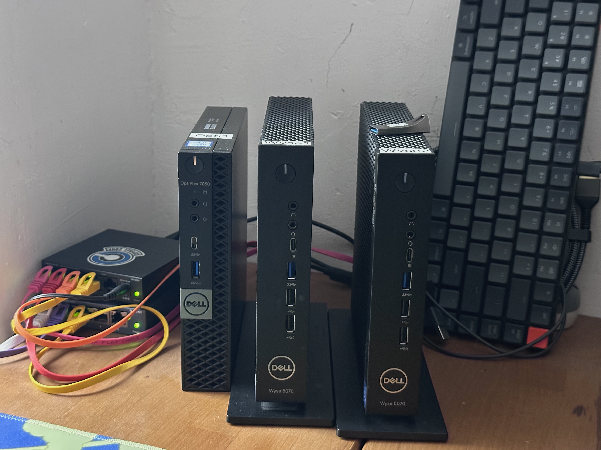

# Younes Yousfi

Freshly graduated software engineer transitioning to DevOps/Cloud.
Building and documenting Kubernetes-based infrastructure in my homelab.

---

## 🚀 Current Focus

- Kubernetes (K3s, cluster setup, networking)
- Infrastructure (VM + bare metal)
- Linux & system administration

---

## 🧪 Homelab Projects

- **Hybrid K3s Cluster (VM + Bare Metal)**  
  Building a lightweight Kubernetes cluster using Proxmox and physical nodes.

_(more projects coming soon)_

---

## Homelab Setup

Small hybrid homelab combining virtualized and bare-metal nodes:

- **Control plane**:
  - Dell OptiPlex 7050 (Proxmox)
  - 4 vCPU, 8 GB RAM
  - Hosts the Kubernetes control plane (k3s)

- **Worker nodes**:
  - 2 × Dell Wyse 5070 (Ubuntu Server)
  - 2 vCPU, 4 GB RAM each
  - Used as bare-metal Kubernetes workers

- **Network**:
  - Simple Ethernet switch
  - Local network, SSH access from MacBook Pro (iTerm)

---

## 🛠️ Tech

- Kubernetes
- Linux
- Docker
- Git / GitHub

---

## 📌 Goals

- Become DevOps / Cloud engineer
- Master Kubernetes fundamentals
- Build real, reproducible infrastructure
